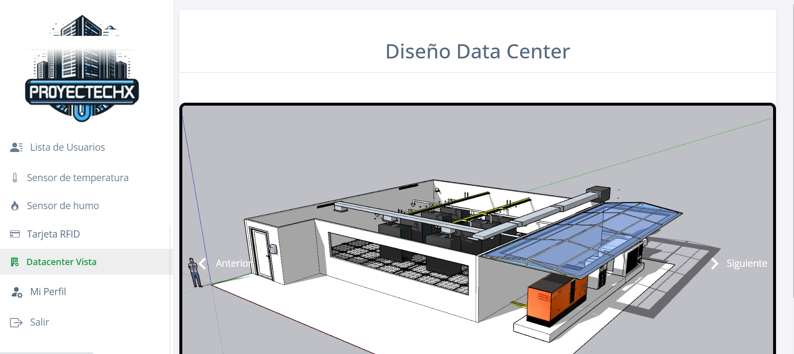
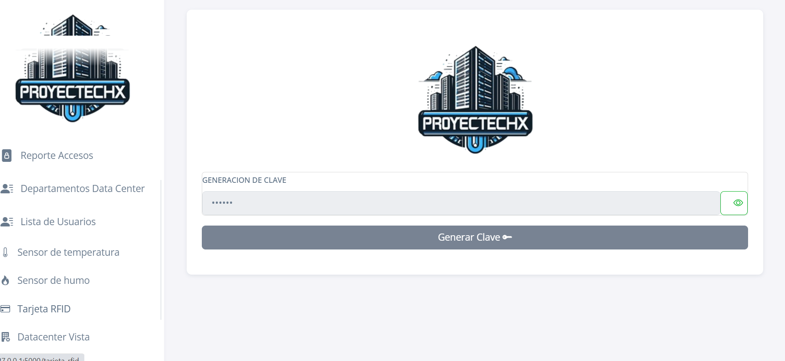
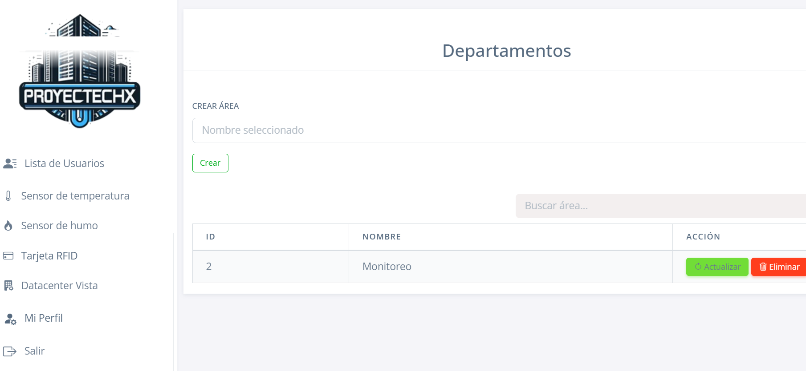
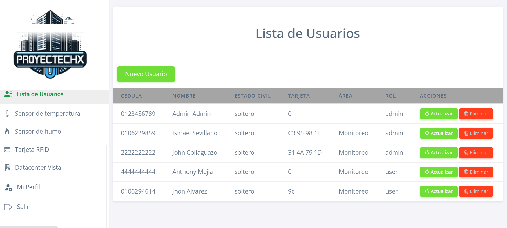
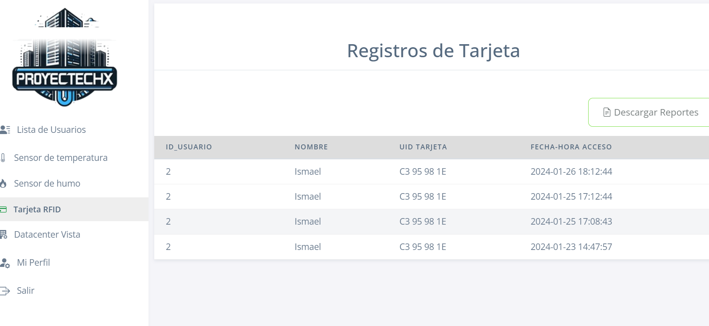
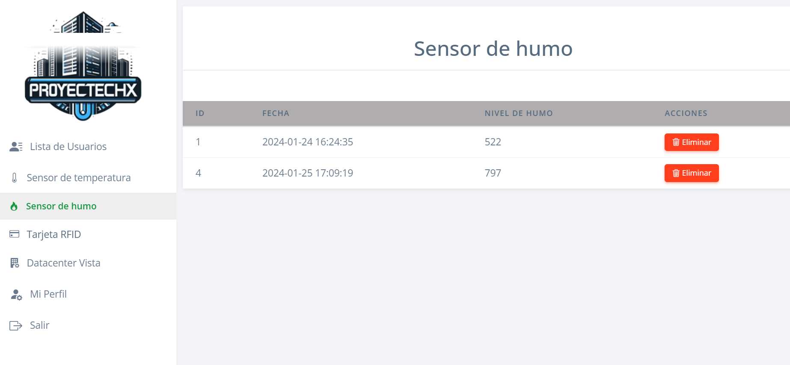
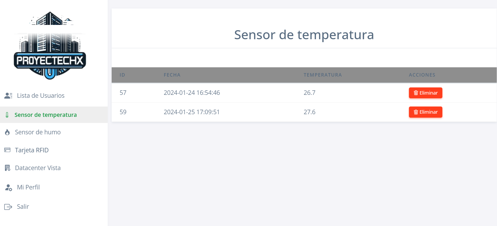

## Proyecto Data Center -- Proyectechx

##### Este proyecto se centra en la creación de una plataforma web integral para la gestión y control de accesos, así como el monitoreo de condiciones ambientales mediante sensores. A continuación, se detallan las principales funcionalidades del sistema.

### Gestión de Usuarios:

###### La página web permite la creación y gestión de usuarios. Los administradores pueden agregar, modificar o eliminar cuentas de usuario según sea necesario.
### Generación de Claves:

###### La plataforma facilita la generación segura de claves para los usuarios. Estas claves podrían ser utilizadas para acceder a la plataforma o para otros propósitos específicos dentro del sistema.
#### Monitoreo de Sensores:

###### Se integran sensores de temperatura y humo para monitorizar las condiciones ambientales. La página web proporciona una interfaz para visualizar en tiempo real los datos recopilados por estos sensores.
### Control de Acceso con Tarjeta RFID:

###### Implementación de un sistema de control de acceso utilizando tarjetas RFID. Los usuarios autorizados pueden utilizar sus tarjetas para acceder a áreas específicas o realizar funciones particulares.
### Diseño del Datacenter en 3D:

###### Se ha creado un modelo tridimensional del datacenter donde se puede visualizar la disposición física de los servidores, equipos y otros componentes. Esto permite una comprensión clara de la infraestructura.
### Integración de Electrónica en Maqueta Física:

###### Además de la representación en 3D, se ha implementado la parte electrónica del diseño en una maqueta física. Esto implica la conexión de los sensores, sistemas de acceso y otros elementos a la maqueta para una representación física funcional del sistema.