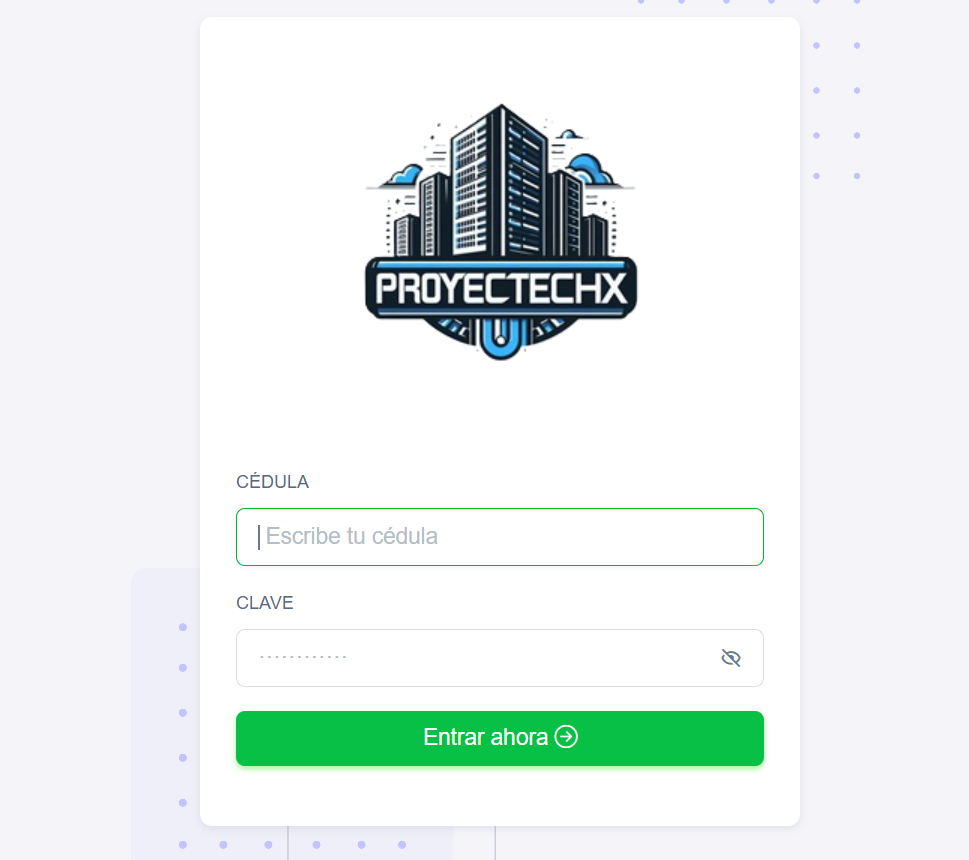

## Proyecto Data Center -- Proyectechx

##### Aprende a desarrollar un sistema CRUD utilizando Python 🐍 y MySQL 💾 mientras creas un impresionante panel de control. Este curso te guiará a través de la creación de aplicaciones interactivas y eficientes, permitiéndote gestionar datos con facilidad.

### Requerimientos 📋

    Servidor Web (Apache)
    MySQL 5 o superior
    phpMyAdmin (opcional)
    Puedes usar un todo en uno como XAMPP, WAMPP u otro.

### Instrucciones para descarga 🔧

    Descarga el proyecto
    Importa el archivo crud_python.sql a MySQL
    Cambia los datos de conexión en el archivo conexionBD.py
    Crea el entono virtual (opcional)  `virtualenv env`
    Activas tu entorno virtual . env/Scripts/activate`
    Ejecutas el archivo `pip install -r requirements.txt` para instalar todos paquetes o   dependencias del proyecto.
    Ingresa desde un navegador a http://127.0.0.1:5600/

### Expresiones de Gratitud 🎁

    Comenta a otros sobre este proyecto 📢
    Invita una cerveza 🍺 o un café ☕
    Paypal iamdeveloper86@gmail.com
    Da las gracias públicamente 🤓.

## No olvides SUSCRIBIRTE 👍
